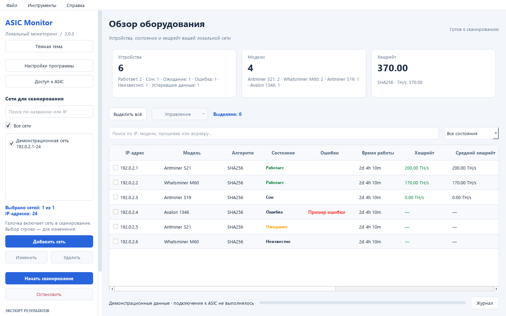
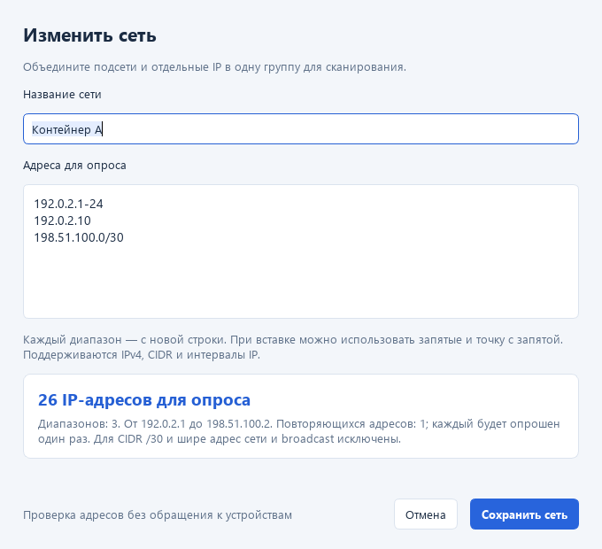

# ASIC Monitor

Локальный сканер и монитор ASIC для Windows. Находит устройства в заданных сетях, показывает их состояние и сохраняет отчёты. Ядро на Python работает отдельно от графического интерфейса.

[](https://github.com/Drubic8/AgentScanner/actions/workflows/tests.yml)
[](https://github.com/Drubic8/AgentScanner/releases/latest)
[](LICENSE)

**[Скачать для Windows](https://github.com/Drubic8/AgentScanner/releases/latest)** · **[Руководство пользователя](docs/user_guide.md)** · **[Сообщить об ошибке](https://github.com/Drubic8/AgentScanner/issues/new/choose)** · **[Участие в разработке](CONTRIBUTING.md)**

**Android:** [исходники, установка и сборка APK](apps/android/README.md) — первая тестовая версия
`0.1.0-alpha.1` с нативным интерфейсом и общим ядром сканера. APK собирается в
[GitHub Actions](https://github.com/Drubic8/AgentScanner/actions/workflows/android.yml).
Проверка на реальном оборудовании ещё требуется; возможности Android описаны отдельно от Windows.



*На снимках демонстрационные данные; это не результаты испытаний реальных моделей.*

## Быстрый старт для Windows

1. Откройте [последний релиз](https://github.com/Drubic8/AgentScanner/releases/latest) и скачайте **ASIC_Monitor.exe**. Python устанавливать не нужно.
2. Запустите программу на компьютере с доступом к сети ASIC.
3. Нажмите **Добавить сеть**, задайте название и адреса, например `192.168.1.0/24` или `192.168.1.10-50`.
4. Отметьте сети галочками и нажмите **Начать сканирование**.
5. При необходимости настройте **Доступ к ASIC** и сохраните результаты в PDF, CSV или XLSX.

Для обновления закройте программу и замените EXE. Сети и настройки хранятся отдельно в `%LOCALAPPDATA%\ASICMonitor` и сохраняются при обновлении. Программа не устанавливается как служба; текущий GUI запускает сканирование вручную.

Контрольная сумма опубликована рядом с EXE в `SHA256SUMS.txt`. Проверка в PowerShell:

```powershell
Get-FileHash .\ASIC_Monitor.exe -Algorithm SHA256
```

Сборка предназначена для Windows x64; испытания выполнены на Windows 11. Дистрибутив пока не подписан сертификатом издателя.

## Возможности

| Задача | Что доступно |
|---|---|
| Поиск устройств | IPv4, CIDR, короткие и полные интервалы; до 4096 уникальных IP на задание |
| Сохранённые сети | Названия, поиск, галочки с сохранением выбора, проверка адресов при вводе |
| Таблица | Модель, прошивка, состояние, хешрейт, температура, вентиляторы, пул и воркер — по данным API устройства |
| Управление | Команды через профиль устройства; доступность зависит от модели, прошивки и проверки команды |
| Отчёты | PDF, CSV, XLSX и снимок таблицы в буфер обмена |
| Интерфейс | Светлая, тёмная и системная темы; настройка столбцов и плотности таблицы |
| Диагностика | Сбор ответов API только для чтения, обезличивание и ZIP для анализа |
| Разработка | Ядро без Qt, каталог профилей, CLI и тесты с искусственными ответами |

### Совместимость с ASIC

В каталоге есть профили чтения для Bitmain Stock, VNish, PitBit, Whatsminer, Avalon, Elphapex, iPollo, Jasminer и общего CGMiner API. **Наличие профиля не означает подтверждённую совместимость со всеми моделями и версиями прошивок.**

Неподтверждённые команды по умолчанию заблокированы. Экспериментальное управление включается явно для выбранных устройств на текущий сеанс. Low/HEM доступны только при наличии соответствующего правила профиля. Пароли действуют только в памяти текущего сеанса.

Для проверки оборудования используйте [матрицу испытаний](docs/testing/asic_acceptance.xlsx) и [инструкцию по диагностике](docs/testing/README.md). Реальное оборудование с компьютера разработки недоступно.

## Новое в 2.0.3

Редактор сетей проверяет адреса при вводе, показывает количество уникальных IP и ошибки с номером строки. Галочки определяют, какие сети сканировать, и сохраняются между запусками. Если снять все галочки, сканирование не запускается.



[Все изменения версии 2.0.3](docs/releases/2.0.3.md) · [История выпусков](CHANGELOG.md)

## Запуск из исходников

Python **3.11+** для ядра; для сборки Windows-релиза используется **Python 3.13**.

```powershell
git clone https://github.com/Drubic8/AgentScanner.git
cd AgentScanner
python -m venv .venv
.venv\Scripts\python -m pip install -r requirements.txt
.venv\Scripts\python gemini_gui.py
```

Только ядро, без GUI:

```shell
python -m pip install .
python -m miner_scanner --profiles
```

`--profiles` показывает каталог без обращения к оборудованию. Для сканирования на ПК с доступом к ASIC:

```shell
python -m miner_scanner 192.168.1.0/24 --workers 32
```

## Для разработчиков

```text
miner_scanner/       Обнаружение, протоколы, профили, телеметрия и команды
  profiles/         Каталог совместимости и правил устройств
  parsers/          Разбор ответов производителей
desktop_ui/         Компоненты PyQt6, настройки, отчёты и обновления
gemini_gui.py       Главное окно и связь с ядром
tests/              Тесты и обезличенные примеры ответов
scripts/            Проверки, синтетический замер скорости и сборка Windows
docs/               Руководства, архитектура, протоколы и приёмка
```

Начните с [CONTRIBUTING.md](CONTRIBUTING.md), [архитектуры](docs/architecture/scanner_refactoring.md) и [добавления новых прошивок](docs/development/adding_device.md).

```shell
python scripts/check_scanner.py
python scripts/benchmark_scanner.py
```

Тесты используют искусственные ответы и локальный TCP-эмулятор `127.0.0.1`. Проверки GUI работают без видимого окна; без desktop-зависимостей они пропускаются. Синтетический замер скорости не является обещанием скорости на реальной площадке.

## Документация и планы

- [Оглавление документации](docs/README.md)
- [Пользовательское руководство](docs/user_guide.md)
- [Сборка EXE и выпуск релиза](docs/development/windows_release.md)
- [Техническое задание](docs/technical_specification.md)
- [План развития](ROADMAP.md)
- [Сообщения об уязвимостях](SECURITY.md)

Android, аппаратное подтверждение совместимости и расширенная история мониторинга остаются задачами следующих этапов. Облачная платформа разрабатывается отдельно и не входит в этот дистрибутив.

## English summary

ASIC Monitor is a local Windows desktop application for ASIC discovery, telemetry and reports. Download `ASIC_Monitor.exe` from [Releases](https://github.com/Drubic8/AgentScanner/releases/latest); Python is not required for the executable. The GUI is currently in Russian. The Python scanner core can be used without Qt. Device profiles exist for several firmware families, but hardware compatibility and control commands require validation on the exact device and firmware. Contributions and bug reports in Russian or English are welcome.

## Лицензия

Исходный код проекта — [MIT](LICENSE). Сторонние библиотеки распространяются на условиях своих лицензий.
