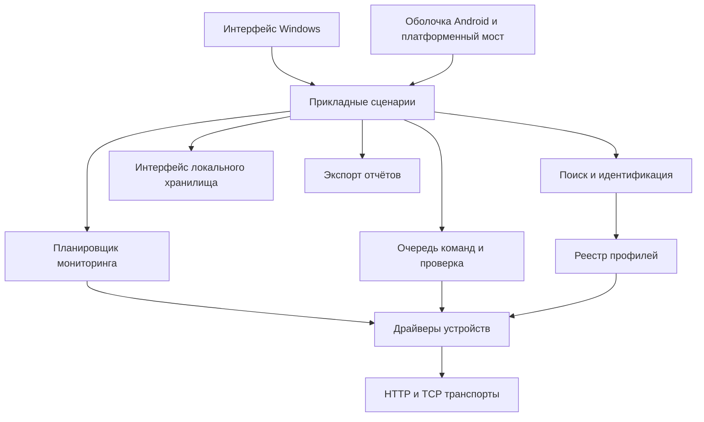

# Техническое задание: универсальная локальная программа мониторинга и управления ASIC

**Рабочее название:** ASIC Monitor.  
**Версия документа:** 1.0 от 15.09.2026.  
**Статус:** проект ТЗ для согласования; составлен по требованиям заказчика и текущему репозиторию.  
**Основная платформа первого выпуска:** Windows x64.  
**Следующая целевая платформа:** Android, с подготовкой архитектуры на первом этапе.

## 1. Цель и основной результат

Создать локальную программу, которая обнаруживает ASIC в заданных сетевых диапазонах, определяет оборудование и прошивку, отображает достоверную телеметрию и выполняет только поддерживаемые конкретным устройством команды.

Программа должна иметь документированную модульную архитектуру: добавление новой совместимой прошивки выполняется через отдельный профиль и тестовые данные; новый протокол добавляется через отдельный драйвер. Разработчик или ИИ-помощник должен понимать, где находятся правила определения, чтения, управления и проверки результата, без изучения всего приложения.

**Ключевой принцип:** пользователь выбирает действие, приложение находит сохранённый паспорт устройства, проверяет актуальность профиля и выполняет заранее определённый сценарий. Подбор управляющих команд методом проб и ошибок запрещён.

Слово «универсальная» означает расширяемость через профили и драйверы. Поддержка всех существующих и будущих ASIC без разработки правил не предполагается.

### 1.1. Обозначения требований

- `FR` — функциональное требование.
- `AR` — архитектурное требование.
- `NFR` — требование к качеству и эксплуатации.
- `AND` — требование к Android.
- `AC` — сценарий приёмки.

Требования обязательны для указанного этапа. Числовые параметры в разделе 12 являются исходными целевыми значениями проекта ТЗ; их изменение до реализации оформляется новой версией документа с обоснованием.

## 2. Основание и состояние текущего проекта

Проведён статический просмотр исходников и документов. Поддержка команд на реальном оборудовании в рамках подготовки ТЗ не проверялась. Перечень файлов и ветвей кода не является сертификатом совместимости.

| Объект | Наблюдаемое состояние | Требование к развитию |
|---|---|---|
| [`gemini_gui.py`](../gemini_gui.py) | Python-точка входа GUI; содержит интерфейс, настройки, экспорт, запуск сканирования и команд, обновление программы | Разделить представление и прикладные сценарии; подготовить собираемый настольный дистрибутив |
| [`miner_scanner/core.py`](../miner_scanner/core.py) | Обнаружение по портам и ответам API, последовательные проверки семейств, пул потоков | Выделить обнаружение, идентификацию, опрос и управление параллелизмом |
| [`miner_scanner/handlers/`](../miner_scanner/handlers/) | Есть обработчики Bitmain Stock, VNish, PitBit, MicroBT, Canaan, Elphapex, iPollo, Jasminer | Переносить проверенные протокольные части в драйверы и профили |
| [`miner_actions.py`](../miner_scanner/handlers/miner_actions.py) | Маршрутизация по строке производителя; особенности авторизации и команд сосредоточены в одном файле | Единый сервис команд и отдельные реализации драйверов |
| [`antminer_profiles.py`](../miner_scanner/handlers/antminer_profiles.py) | Первые профили и преобразования полей; есть подбор по подстроке модели и отправка обоих ключей для неизвестного варианта | Формализовать применимость, исключить неопределённую запись |
| [`command_verifier.py`](../miner_scanner/handlers/command_verifier.py) | Проверка режима повторным чтением конфигурации | Общий механизм проверки с правилами конкретного профиля |
| [`requirements.txt`](../requirements.txt) | Указан PyQt5, тогда как основной GUI импортирует PyQt6 | Согласовать зависимости с выбранным стеком и проверять сборку в чистом окружении |
| [`plans/fms_architecture.md`](../plans/fms_architecture.md) | Описана архитектура агента для центральной FMS | Использовать полезные идеи разделения, не делать облако обязательным для локальной программы |

Обнаруженные архитектурные ограничения:

1. GUI восстанавливает производителя из текста столбца модели; текст таблицы фактически участвует в выборе команды.
2. Отмена сканирования реализована глобальной подменой методов `socket.socket` и флагом `socket.ABORT_SCAN`.
3. Полноценный единый контракт паспорта, версии прошивки и возможностей команд не проходит через основной GUI-сценарий управления.
4. Часть исключений подавляется, поэтому недоступность устройства и ошибка распознавания могут выглядеть одинаково.
5. В обработчике Whatsminer есть перебор встроенного списка паролей и включение использованного пароля в сообщение успеха. В целевой реализации это исключается.
6. Документы по профилям, матрице команд и проверке результата местами расходятся с кодом и друг с другом. В частности, описаны неоднозначные поля режима и принятие таймаута перезагрузки за успех.

Текущее ТЗ определяет целевое поведение. Старые API-документы — исходные материалы для проверки, а не безусловно правильные инструкции по управлению.

## 3. Границы продукта и этапов

### 3.1. Первый настольный выпуск

- Локальная работа без обязательного интернета, регистрации, облачного сервера и внешней базы данных.
- Поиск, периодический мониторинг, таблица и карточка ASIC.
- Паспорта устройств, реестр профилей и поддержка команд по возможностям прошивки.
- Индивидуальные и групповые команды, журнал и проверка результата.
- Настройки диапазонов, опроса, учётных данных, столбцов и отчётов.
- Экспорт CSV, XLSX и PDF; сохранение необходимых данных между запусками.
- Переход от текущего кода по этапам с сохранением проверенных пользовательских сценариев.
- Контракты и технический прототип для последующего Android-переноса.

### 3.2. Последующий выпуск Android

Базовое проектное допущение: Android-приложение самостоятельно сканирует и управляет ASIC в доступной локальной сети без работающего ПК. Ответ заказчика может уточнить этот режим до фиксации мобильного стека; подробности — раздел 13.

### 3.3. За пределами обязательного первого выпуска

Облачная FMS, биллинг, расчёт доходности, обмен с Google Sheets, установка прошивок, изменение сетевых адресов и пулов, произвольный SSH/терминал, индивидуальный разгон частот и напряжений, iOS, обязательная поддержка Linux/macOS, долговременная аналитика и автоматические управляющие сценарии. Они могут подключаться позднее через публичные интерфейсы ядра.

Существующие `cloud_platform`, `fms_agent`, `agent_core.py`, `agent_ui.py` не удаляются автоматически при реорганизации. Их зависимости от сканера инвентаризируются; необходимые точки совместимости сохраняются на период миграции.

## 4. Термины и модель предметной области

| Термин | Значение |
|---|---|
| Паспорт устройства (`DeviceIdentity`) | Сведения о конкретном ASIC: идентификатор, адрес, производитель, модель, ревизия, прошивка, версия API, привязка к профилю |
| Профиль совместимости (`DeviceProfile`) | Версионируемое правило для проверенного сочетания оборудования, прошивки и API; задаёт чтение, команды и проверку |
| Драйвер (`DeviceDriver`) | Реализация протокола и сценариев взаимодействия, используемая одним или несколькими профилями |
| Возможность (`Capability`) | Поддерживаемое действие или параметр, его ограничения, доступность сейчас и способ проверки |
| Телеметрия (`TelemetrySnapshot`) | Нормализованный снимок измерений с единицами, временем и качеством данных |
| Идентификация (`Fingerprint`) | Набор полученных признаков, на основании которых выбран профиль |
| Подтверждение результата | Проверка фактического состояния после команды отдельно от подтверждения приёма запроса |

### 4.1. Разделение состояния

Нельзя сводить все состояния к одному цвету или определять сон только по нулевому хешрейту. Хранить независимо:

- **Связь:** `reachable`, `unreachable`, `unknown`.
- **Доступ API:** `available`, `auth_required`, `forbidden`, `unsupported`, `error`, `unknown`.
- **Майнинг:** `running`, `stopped`, `starting`, `rebooting`, `unknown`.
- **Исправность:** `ok`, `warning`, `error`, `unknown`, с кодами и пояснениями.
- **Свежесть данных:** время последнего успешного измерения, признак `stale`.

Пользовательский итоговый статус вычисляется из этих полей. `Offline` означает недоступность, а не физическое отключение питания. `Sleep` показывается только при подтверждении соответствующего состояния профилем; остановленный процесс может называться «Майнинг остановлен».

## 5. Поиск и мониторинг

### FR-01. Диапазоны

Поддержать отдельный IPv4, CIDR, диапазон `192.168.1.10-192.168.1.200`, сокращённый диапазон `192.168.1.10-200`, несколько именованных групп и исключения адресов. Проверять ввод до запуска, объединять пересечения без повторного опроса, показывать число адресов. Для CIDR документировать правила адресов сети, broadcast, `/31` и `/32`. IPv6 — расширение последующего этапа.

Перед запуском проверять доступность выбранного сетевого интерфейса. Сканировать только заданные пользователем адреса; отсутствие ответа на ping не является основанием пропустить проверку ASIC API.

### FR-02. Обнаружение

Использовать ограниченный набор безопасных запросов чтения. Начальный перечень транспортов по текущему коду: TCP 4028, HTTP/HTTPS, Whatsminer RPC TCP 4433, Elphapex TCP 9588. Порты задаются транспортами/профилями и могут настраиваться.

Открытый порт — признак доступного сервиса, а не доказательство производителя. Устройство считать ASIC после проверки структуры ответа. Неподдерживаемый ASIC показывать как «ASIC, профиль не определён»; обычный сетевой узел не включать в список ASIC, сохраняя результат в диагностике сканирования.

Обеспечить обнаружение доступного через web API ASIC при недоступном майнинговом порте, если такая проверка поддержана профилем. Поиск не должен останавливать майнинг, менять конфигурацию или включать индикацию.

### FR-03. Идентификация и актуальность

Определять производителя, точную модель, аппаратную ревизию при наличии, семейство и версию прошивки, версию API, серийный номер/MAC при наличии. Хранить исходные строки отдельно от нормализованных значений. Отсутствующие сведения обозначать `unknown`, не заменять догадкой.

Правила выбора профиля:

1. Собрать признаки чтением доступных API и сопоставить с ограничениями профилей.
2. Специфическое правило с явными границами совместимости имеет приоритет перед семейным; порядок регистрации файлов не должен влиять на результат.
3. Выбранный профиль должен удовлетворять всем своим обязательным признакам. Равнозначные либо противоречащие результаты дают `ambiguous`, а не случайный выбор.
4. Для неизвестной версии разрешено только явно заявленное и проверенное правило совместимости по API/сигнатуре. Нельзя автоматически считать любую более новую версию совместимой.
5. Сохранять `profile_id`, `profile_version`, версию драйвера, признаки и время проверки. Состояние идентификации: `matched`, `ambiguous`, `unknown`.
6. При изменении прошивки, ревизии, API, идентичности устройства или версии правил аннулировать старую привязку и повторить идентификацию.

Предусмотреть кэш в оперативной памяти и постоянное локальное хранилище. Обычный опрос использует сохранённый профиль; идентификация не повторяется целиком при каждом измерении. Перед управляющей записью выполняется короткая проверка идентичности и совместимости выбранного профиля. При расхождении запись не отправляется.

Если API не сообщает версию, разрешение управления требует документированной сигнатуры совместимости конкретного профиля. Одной похожей строки модели недостаточно.

### FR-04. Циклический опрос и отмена

Поддержать разовый поиск, ручное обновление выбранных устройств и периодический мониторинг. Частоту поиска новых адресов отделить от частоты опроса уже известных ASIC. Одинаковые задания для одного устройства не должны бесконтрольно накапливаться.

Показывать прогресс, завершённые/оставшиеся адреса, найденные ASIC и ошибки. Отмена прекращает постановку новых запросов, завершает текущие в пределах заданного deadline и сохраняет уже полученные результаты. Для каждой операции использовать собственный механизм отмены; отмена сканирования не отменяет постороннюю команду.

При временной недоступности ранее известный ASIC остаётся в реестре с последними данными и отметкой устаревания. Отмена сканирования и ошибка сети самого ПК не должны массово переводить все устройства в подтверждённый `Offline`.

## 6. Телеметрия и интерфейс

### FR-05. Нормализованные данные

Минимальный набор полей при наличии в API:

| Группа | Поля |
|---|---|
| Идентификация | IP, производитель, модель, ревизия, семейство и версия прошивки, API, серийный номер, MAC |
| Работа | Состояние майнинга, режим мощности, uptime устройства и отдельно процесса, если доступны |
| Производительность | Алгоритм, текущий/средний хешрейт, окно усреднения, ожидаемый хешрейт при наличии достоверного источника |
| Охлаждение | Температуры плат/чипов, минимальная/максимальная, вентиляторы и RPM |
| Комплектность | Список плат, обнаруженные/ожидаемые платы и чипы при доступности |
| Пулы | Адреса, активный пул, worker, состояние подключения, rejected/HW errors при наличии |
| Энергия | Мощность в W и эффективность при наличии измерений; источник «измерено»/«оценка» |
| Диагностика | Коды и пояснения ошибок, последнее успешное чтение, длительность опроса |

В ядре хранить числа, а не оформленные строки. Для хешрейта использовать базовую единицу `H/s`, для алгоритмов, измеряемых решениями, — `Sol/s`; тип величины и алгоритм сохранять отдельно. Преобразование исходных единиц задаёт профиль по документации API. Запрещено определять единицу только по величине числа. Суммирование допустимо только внутри совместимого алгоритма и типа величины.

Неизвестное значение не равно нулю. Каждое необязательное поле допускает `null` и причину отсутствия. Известные значения сохраняются при частичном ответе с явной отметкой их возраста. Не вычислять «потерянные платы» по непроверенному стандартному количеству для похожей модели.

### FR-06. Таблица и карточка

Поддержать сортировку по числовым значениям и IP, поиск, фильтры по модели, прошивке, статусу и группе, множественное выделение. Настраивать видимость, порядок и ширину столбцов; сохранять настройки и позволять их сбросить.

В карточке показывать полную идентификацию, актуальность, доступные команды и причину недоступности, платы, вентиляторы, пулы и ошибки. Диагностические идентификаторы профиля и драйвера размещать в технических подробностях.

Таблица отображает модель данных; сервисы не извлекают производителя, адрес назначения или профиль из отображаемого текста. Обновление данных сохраняет выделение, фильтры и сортировку. Интерфейс остаётся доступен при опросе, экспорте и выполнении команд. Основной язык первого выпуска — русский; строки интерфейса должны допускать локализацию.

## 7. Управление устройствами

### FR-07. Единые действия и различия устройств

| Действие пользователя | Идентификатор | Семантика |
|---|---|---|
| Подсветить | `identify_on` | Включить поисковую индикацию |
| Отключить подсветку | `identify_off` | Завершить поисковую индикацию, вернуть обычное поведение LED |
| Перезагрузить | `reboot` | Перезагрузить устройство предусмотренным профилем способом |
| Остановить майнинг | `mining_stop` | Остановить вычисления; точное состояние оборудования определяется профилем |
| Возобновить майнинг | `mining_start` | Возобновить вычисления; не означает автоматически сменить режим мощности |
| Режим Low | `set_power_mode(low)` | Применить поддерживаемый прошивкой штатный режим пониженной мощности |
| Режим Normal | `set_power_mode(normal)` | Вернуть штатный обычный режим мощности, если доступен |
| Режим HEM | `set_power_mode(hem)` | Применить соответствующий штатный режим только при подтверждённой семантике профиля |

«Остановить», «сон», «Low» и «Normal» не являются взаимозаменяемыми командами. У `mining_start` и `set_power_mode(normal)` разные контракты. Для HEM до уточнения заказчиком не фиксируется универсальная расшифровка: название производителя, фактический эффект и значение API указываются в профиле. Нельзя подменять HEM похожим режимом, самостоятельно выставлять напряжение или частоту.

Если устройство предлагает только переключение LED (`toggle`), нельзя представлять одинаковую команду как гарантированные «включить» и «выключить». Использовать чтение состояния для достижения нужного результата, а при его отсутствии показывать отдельное действие «Переключить индикацию» и недоступность точного on/off.

Если возобновление возможно только через перезагрузку либо переключение режима запускает перезагрузку, карточка действия до отправки показывает это последствие. Автоматическое возвращение в ранее установленный режим после остановки допускается только при надёжно сохранённом и поддерживаемом значении.

### FR-08. Доступность действий

Для каждого действия хранить отдельно поддержку и текущую доступность:

- Поддержка: `supported`, `unsupported`, `unknown`.
- Доступность: `available`, `auth_required`, `write_forbidden`, `busy`, `unreachable`, `profile_stale`.
- Допустимые параметры, необходимые права, последствия, способ проверки и допустимость повтора.

UI строит список кнопок по этим сведениям. Драйвер повторно проверяет их при исполнении. Неизвестный/неоднозначный профиль допускает безопасное чтение и диагностику, но не управляющую запись. Нельзя обходить запрет выбором производителя в GUI.

### FR-09. Выполнение и проверка

1. Получить запрос с `command_id`, `device_id`, действием и валидированными параметрами.
2. Зафиксировать цель и профиль, проверить актуальность адреса, идентичность, доступность действия и права.
3. Поставить команду в ограниченную очередь; для одного ASIC не выполнять конфликтующие записи одновременно.
4. Выполнить ровно тот сценарий, который определён профилем. Многошаговый сценарий допустим, если каждый шаг и условие перехода документированы.
5. Раздельно записать факт отправки и подтверждение приёма API, затем проверить ожидаемое состояние запросами чтения.
6. Вернуть структурированный результат, обновить состояние устройства и журнал.

HTTP 200, пустой ответ, обрыв соединения и таймаут сами по себе не доказывают выполнение. Результат команды содержит стадии `queued`, `running`, `verifying` и итог:

- `succeeded` — достигнуто состояние по критерию профиля;
- `failed` — устройство отклонило запрос либо проверка установила невыполнение;
- `unconfirmed` — выполнение возможно, но не подтверждено;
- `unsupported` — действие не поддерживается;
- `cancelled` — отменено до отправки;
- `skipped` — не отправлялось из-за невыполненных условий.

В результате сохранять отдельно `accepted_by_api`, основание вывода и наблюдённые значения. Для LED без обратного чтения допустимо «Команда принята, состояние не подтверждено», а не гарантированное «Подсветка включена».

| Действие | Требуемый принцип проверки |
|---|---|
| Остановка/запуск | Состояние процесса/режима из API; хешрейт — дополнительный признак с учётом времени запуска |
| Low/Normal/HEM | Повторное чтение фактического режима, а при двухфазном применении — окончание перехода |
| Перезагрузка | Повторное появление того же устройства и сброс uptime/смена boot ID или иной проверенный признак профиля; одна недоступность недостаточна |
| Индикация | Чтение состояния LED, если API его предоставляет; иначе явный неподтверждённый результат |

Повторять запросы чтения можно в рамках лимита времени. Управляющий запрос автоматически повторяется только при доказанной идемпотентности и политике профиля. `reboot` и `toggle` не переотправлять после неоднозначного ответа. Общего fallback по альтернативным управляющим адресам и форматам не должно быть. Версионные варианты выбираются при идентификации.

Если запись требует полного конфига, драйвер читает текущую конфигурацию, изменяет разрешённые поля и сохраняет остальные. Документировать обязательные поля, типы, замаскированные секреты и последствия записи. Если безопасно восстановить конфигурацию нельзя, команда недоступна. Нельзя отправлять неподтверждённые значения пулов, паролей и частот.

### FR-10. Групповые действия

До выполнения показать действие, количество и список целей, поддерживаемые/пропускаемые устройства и существенные последствия. Для перезагрузки, остановки и смены мощности использовать единое подтверждение всей выбранной операции. Для LED достаточно явного запуска пользователем.

Фиксировать список целей по `device_id`, а не номерам строк; обновление сортировки не меняет адресатов. Каждая цель получает собственный результат. Ошибка одного устройства не прерывает обработку остальных. Отмена группы отменяет неотправленные команды; отправленные продолжают проверяться и не маркируются как отменённые задним числом.

## 8. Хранение, настройки и отчёты

### FR-11. Постоянные данные

Использовать локальную SQLite-базу за интерфейсом репозитория; настройки интерфейса могут храниться в отдельном версионируемом файле. Путь данных определяется платформой и не зависит от текущего рабочего каталога или прав записи в каталог установки.

| Сущность | Минимальный состав |
|---|---|
| `DeviceIdentity` | UUID, текущие адреса и их история, стабильные признаки, производитель/модель/ревизия, прошивка/API, первый и последний контакт |
| `ProfileBinding` | `device_id`, профиль/версия/драйвер, fingerprint, основание выбора, время проверки и срок актуальности |
| `TelemetrySnapshot` | `device_id`, время сбора, поля/единицы/качество, статус и ошибки |
| `CommandRequest/Result` | ID команды/группы, цель, профиль и его версия на момент отправки, действие, параметры без секретов, стадии, итог, времена и диагностика |
| `ScanGroup` | Название, диапазоны, исключения, выбранный интерфейс и параметры опроса |
| `Settings` | Столбцы, фильтры, интервалы, лимиты, экспорт, ссылки на наборы учётных данных |

IP не является постоянным идентификатором ASIC. Для сопоставления использовать доступные серийные номера/MAC и дополнительные признаки; MAC может быть недоступен через маршрутизатор, а серийные номера могут повторяться. При конфликте не объединять записи автоматически. Если стабильного идентификатора нет, помечать идентичность как ограниченно подтверждённую и не переносить профиль/учётные данные на заменивший устройство ASIC без повторной проверки.

После перезапуска данные отображаются как сохранённые до нового опроса. Команды с неизвестным исходом восстанавливаются как `unconfirmed` и могут проверяться чтением; автоматическое повторное исполнение запрещено. Миграции БД версионируются, перед ними создаётся резервная копия; предусматривается документированное восстановление.

### FR-12. Учётные данные и настройки

Поддержать явное назначение набора учётных данных устройству или группе с приоритетом устройства. Проверка доступа отделена от выполнения команды. Нет автоматического перебора популярных паролей. Обновление токена внутри известной схемы авторизации допускается по правилам драйвера.

Секреты хранить через платформенный защищённый механизм; в SQLite/настройках — ссылку на запись. Если защищённое сохранение недоступно, предлагать ввод на сеанс, не записывать открытый пароль молча. Маскировать секреты в исключениях, URL, запросах, логах, отчётах и диагностических примерах.

Настройки: диапазоны, интервалы и таймауты, ограничения параллелизма, столбцы и сортировка, тема, каталоги и параметры экспорта, срок хранения журналов. Проверять значения, поддерживать импорт/экспорт настроек без секретов и сброс выбранного раздела.

### FR-13. Экспорт

Сохранить CSV UTF-8, XLSX и PDF. Пользователь выбирает все/отфильтрованные/выделенные устройства, столбцы и сортировку. Настройки экранной таблицы и отчётов независимы.

Отчёт строится из согласованного снимка данных ядра и включает время формирования, область выборки, время измерения/признак устаревания и единицы. Кириллица должна корректно отображаться, длинные поля переноситься в PDF, заголовки повторяться на страницах. В XLSX числовые поля сохраняются числами; контролировать интерпретацию внешних строк как формул в XLSX и CSV. Для пустой выборки выводить понятное сообщение.

Не экспортировать секреты. Ошибка записи или занятый файл не повреждает существующий отчёт и не останавливает мониторинг. Действующие сценарии сохранения, выбора каталога и копирования файла в буфер обмена настольной версии включаются в регрессионную проверку.

## 9. Целевая архитектура

### AR-01. Модульный локальный продукт

Первый выпуск — модульное приложение с единым ядром и платформенной оболочкой. Внутрипроцессные вызовы достаточны; обязательный локальный web-сервер или набор микросервисов не требуется.



Это схема потока вызовов; платформенные реализации транспорта, секретов и хранения подключаются через интерфейсы. Общие модели не зависят от GUI и внешних API.

### AR-02. Ответственность слоёв

| Слой | Ответственность | Не допускается |
|---|---|---|
| `domain` | Модели, состояния, единицы, возможности и правила предметной области | Импорты Qt, HTTP-клиента, SQL и Android UI |
| `application` | Поиск, мониторинг, управление, очередь, отмена, события | Адреса CGI и особенности конкретной прошивки |
| `devices` | Реестр, профили, драйверы, преобразование API и проверка состояния | Работа с виджетами и текстом таблицы |
| `infrastructure` | Сеть, БД, секреты, файловая система, журнал | Решения о производителе по отображаемой модели |
| `presentation` | Таблица, карточки, настройки и диалоги | Прямые запросы на ASIC, выбор формата управляющего payload |

### AR-03. Структура репозитория

Целевой вариант для сохранения Python-ядра; окончательное устройство Android-моста уточняется прототипом до массового рефакторинга:

```text
MinerHotel/
├── pyproject.toml                 # Метаданные, зависимости и инструменты
├── README.md                     # Установка, запуск, навигация
├── src/asic_monitor/
│   ├── domain/                   # Модели и контракты
│   ├── application/              # Сценарии, очередь, планировщик, события
│   ├── devices/
│   │   ├── registry.py
│   │   ├── drivers/              # Код протоколов и семейств прошивок
│   │   └── profiles/             # Декларативные правила совместимости
│   ├── infrastructure/
│   │   ├── transports/           # HTTP, TCP, авторизация
│   │   ├── persistence/          # SQLite и миграции
│   │   ├── credentials/          # Платформенное хранение секретов
│   │   └── logging/
│   ├── reporting/                # CSV, XLSX, PDF
│   ├── presentation/desktop/     # Окна и модели представления
│   └── bootstrap.py              # Сборка компонентов и точка входа
├── apps/android/                 # Android-оболочка, мост, сборка
├── contracts/                    # Независимые от языка схемы данных
├── tests/
│   ├── unit/
│   ├── contract/
│   ├── integration/
│   ├── acceptance/
│   └── fixtures/devices/         # Обезличенные ответы по профилям
├── docs/
│   ├── technical_specification.md
│   ├── architecture/             # Решения и ограничения
│   ├── development/              # Включая adding_device.md
│   ├── compatibility/            # Проверенная матрица оборудования
│   ├── protocols/                # Описание API и первоисточники
│   └── user/                     # Руководство оператора
├── scripts/                      # Сборка и обслуживающие инструменты
└── assets/                       # Иконки, шрифты, ресурсы
```

Переименование папок само по себе не считается выполнением ТЗ: проверяется фактическое направление зависимостей. Производитель и прошивка могут требовать отдельных драйверов, но копировать весь сетевой стек для каждого профиля нельзя. Разделение папок по слоям допускает небольшие модули без избыточной абстракции.

Во время миграции допускается временный `gemini_gui.py` как совместимая точка запуска и обёртки для потребителей старого `miner_scanner`. Их срок удаления задаётся планом миграции. `debug`, дампы, сторонние проекты и сборочные артефакты не входят в основной runtime-пакет; перенос выполняется после инвентаризации ссылок и лицензий.

### AR-04. Контракты

Зафиксировать типизированные входы/выходы для:

- `discover(scope, options, cancellation)` → поток событий обнаружения;
- `identify(endpoint, evidence)` → паспорт, результат сопоставления и диагностические причины;
- `read_telemetry(device_context)` → снимок с качеством полей;
- `get_capabilities(device_context)` → доступные возможности;
- `execute(command, device_context)` → результат отправки;
- `verify(command, device_context)` → результат проверки состояния;
- репозиториев, транспорта, поставщика секретов и экспортёров.

`device_context` содержит паспорт, выбранный профиль, транспорт и ссылку на учётные данные. GUI передаёт идентификатор устройства и намерение. Контракты описываются схемами в `contracts/`; время — UTC с явным часовым поясом, локальное отображение — обязанность оболочки. Версии схем и профилей независимы от версии приложения.

Ошибки типизированы: сеть/таймаут, авторизация, запрет записи, неподдерживаемое действие, неизвестный профиль, несовместимый ответ, проверка не пройдена, отмена, ошибка хранения. Каждая имеет машинный код и понятное сообщение. Пустой результат не заменяет ошибку разбора ответа.

## 10. Профили и добавление новой прошивки

### AR-05. Обязательный состав профиля

| Раздел | Содержимое |
|---|---|
| Идентификатор | Уникальный `profile_id`, версия профиля, версия схемы, совместимые версии драйвера |
| Применимость | Производитель, точные модели/семейства, ревизии, прошивка, диапазоны версий/API, обязательные и исключающие признаки |
| Источники | Документация, обезличенные ответы, протоколы испытаний и известные ограничения |
| Чтение | Безопасные запросы, отображение полей, исходные единицы, обработка частичного ответа |
| Управление | Возможности, точный сценарий, авторизация, типы параметров, предпосылки и последствия |
| Проверка | Ожидаемое состояние, запросы проверки, интервалы, deadline, критерии результата |
| Устойчивость | Лимиты соединений, повторы, ограничения нагрузки, признаки несовместимости |
| Статус | `experimental`, `verified`, `deprecated`, с датой и объёмом испытаний |

Декларативные правила хранить в JSON/YAML с проверкой схемы; сложный протокол и авторизацию — в драйвере. Конкретный формат закрепить одним архитектурным решением. Запрещены произвольные `eval`, shell-команды и исполняемые фрагменты в файлах правил. Профили распространяются вместе с проверенным выпуском; загрузка неизвестного кода из сети не нужна для первого этапа.

Версии прошивок не всегда соответствуют SemVer: правило должно задавать способ разбора, сравнения и обращения с неизвестным форматом. Приоритеты и конфликты реестра проверяются автоматически. Экспериментальные управляющие возможности не активируются в обычном режиме до проверки на стенде.

### AR-06. Порядок расширения для разработчика и ИИ

1. Прочитать `docs/development/adding_device.md`, схему профиля и ближайший пример.
2. Получить обезличенные ответы обнаружения, идентификации, телеметрии и необходимые сведения о командах. Отметить источник каждого правила; не выдумывать endpoint, payload и значения режима.
3. Определить, достаточно нового профиля существующего драйвера или нужен отдельный драйвер/адаптер.
4. Создать правило с узкими условиями совместимости, исключениями и явно неизвестными возможностями.
5. Добавить fixture-набор и проверки позитивного определения, близкой несовместимой версии, неверного производителя, неполного ответа и единиц измерения.
6. Для команд проверить точный формат и типы запроса, отказ авторизации, неоднозначный ответ, проверку состояния, ограничения повторов и сохранение посторонних полей конфига.
7. Выполнить контрактные проверки нового профиля и регрессию существующих; провести аппаратные испытания заявляемого управления.
8. Обновить матрицу совместимости и журнал изменений. Без аппаратного подтверждения отметить управление как экспериментальное/непроверенное.

**Критерий расширяемости:** добавление версии в пределах существующего протокола требует изменения профиля, fixtures и документации, но не GUI, общего диспетчера команд и планировщика. Новый протокол допускает новый драйвер и его регистрацию без добавления условий по производителям в интерфейс.

В руководстве привести полностью рабочий пример профиля и тестов из подтверждённого оборудования. Все шаблонные данные явно отличать от действительных правил. ИИ используется как инструмент разработки; для работы установленной программы доступ к ИИ не требуется.

### 10.1. Начальный охват

Исходная очередь миграции по имеющимся обработчикам:

| Семейство | Исходная база | Условие включения в выпуск |
|---|---|---|
| Bitmain Antminer Stock | Stock parser, web fallback, текущие Antminer profiles | Раздельная проверка сочетаний модель/ревизия/прошивка и типов полей |
| Antminer VNish | `antminer_vnish.py`, API-материалы | Отдельные профили совместимых версий API и авторизации |
| Antminer PitBit | `antminer_pitbit.py`, профильные дампы | Самостоятельная идентификация, чтение и подтверждённые команды |
| MicroBT Whatsminer | RPC v3, транспорт и словари | Проверка версии протокола, авторизации и write access |
| Canaan Avalon | Avalon parser, socket-команды | Явная семантика LED и способ возобновления майнинга |
| Elphapex | Сканирование TCP/web и команды | Проверка конкретной модели/прошивки и схемы доступа |
| iPollo | Обработчик телеметрии | Чтение по подтверждённым профилям; управление только при отдельном подтверждении |
| Jasminer | Web/parser и обработчик команд | Раздельный статус поддержки каждой команды |

Наличие обработчика не означает поддержку Low/HEM или всех команд. Перед разработкой релиза составить матрицу `производитель → модель → ревизия → прошивка → API → чтение → каждое действие → способ проверки → доказательство`. Поля без доказательств остаются «не проверено»; нельзя заменять конкретные версии формулировкой «все прошивки».

## 11. Надёжность и эксплуатация

### NFR-01. Локальность и управляемая нагрузка

Все основные функции работают без интернета. Локальная связь с ASIC сохраняется при недоступном облаке и сервисах обновления. Обновление приложения — отдельный сценарий с проверкой происхождения/целостности пакета и сохранением данных; оно не должно прерывать выполняемую управляющую операцию.

Использовать ограниченные очереди, явные таймауты соединения/чтения и общий deadline операции. Для одного ASIC учитывать ограничения API и последовательно выполнять конфликтующие записи. Не создавать неограниченное число потоков при групповой операции. Чтение для проверки команды имеет управляемый приоритет перед плановым опросом.

### NFR-02. Диагностика и данные

Журнал содержит время, уровень, компонент, устройство, `scan_id`/`command_id`, версию профиля и код результата. Предусмотреть ротацию и очистку по сроку/объёму. Диагностический пакет создаётся по действию пользователя и проходит обезличивание; автоматически никуда не отправляется.

Повреждённый ответ, слишком большой пакет, некорректный JSON, незавершённый TCP-пакет и недоступный ASIC не должны завершать приложение. Транспорты ограничивают размер ответа и корректно дочитывают сообщения согласно протоколу. Секреты не включаются даже в диагностический traceback.

Сетевые ограничения и доступ к устройствам настраиваются явно. Использовать защищённый транспорт, когда он поддержан профилем; необходимость legacy HTTP или особого сертификата документировать для конкретного профиля, не отключать проверки глобально.

### NFR-03. Сборка и сопровождение

Один актуальный источник зависимостей, фиксируемые версии для воспроизводимой сборки, отдельные зависимости ядра/desktop/разработки. Проверять установку на чистой поддерживаемой Windows без отдельно установленного Python. Выпуск содержит версию приложения, набор профилей, инструкции и журнал изменений.

Соблюдать лицензии используемых библиотек, шрифтов и сторонних материалов; вложенный `docs/pyasic_docs` не становится зависимостью приложения автоматически. Проверки включают форматирование, статический анализ, типизацию публичных контрактов и необходимые тесты, запускаемые одной документированной командой.

## 12. Целевые параметры и стенд измерений

Следующие значения — предлагаемый базовый профиль для Windows, а не утверждение о производительности текущего кода:

| Параметр | Начальное значение / критерий |
|---|---|
| Размер реестра | 1 000 ASIC, до 4 096 адресов за одно задание поиска |
| Параллельный опрос | 64 устройства по умолчанию, настройка 1–256 с ограничениями драйверов |
| Параллельное управление | 8 устройств по умолчанию, не более одной конфликтующей записи на ASIC |
| Таймаут соединения / чтения | 2 / 5 секунд по умолчанию; профиль может уточнять |
| Deadline обработки адреса | 15 секунд при стандартном поиске; расширенная диагностика отдельным действием |
| Интервал телеметрии / поиска новых | 30 секунд / 10 минут по умолчанию; перегрузка не создаёт растущую очередь |
| Проверка привязки профиля | При запуске, перед записью, при признаке изменений; плановая полная проверка раз в 24 часа |
| Устаревание / недоступность | `stale` после двух пропущенных интервалов; `unreachable` после трёх завершённых неудачных циклов при исправной локальной сети |
| Отмена | UI реагирует ≤ 1 с; новые запросы не запускаются после обработки отмены; завершение активных ограничено оставшимся deadline |
| Поиск 254 адресов | ≤ 90 с на стенде ниже; публикация фактических результатов |
| Опрос 1 000 доступных эмуляторов | Цикл ≤ 30 с на стенде ниже, без роста очереди |
| Интерфейс с 1 000 строк | 95-й процентиль реакции на фильтр/сортировку ≤ 300 мс |
| Длительный прогон | 24 ч мониторинга без необработанных исключений; прирост памяти ≤ 10% после прогрева при фиксированном объёме данных |
| Журналы | 30 дней, ограничение 200 МБ; последнее состояние и паспорта хранятся до удаления пользователем |

Стенд: Windows x64, не менее 4 логических ядер, 8 ГБ RAM, локальная сеть 1 Гбит/с; эмуляторы поддерживаемых профилей с ответами ≤ 100 мс и до 64 КиБ на запрос. Для теста поиска — 254 адреса, 20% доступных устройств и 80% адресов с отсутствием ответа, по не более пяти коротких запросов на доступный адрес. Для теста 1 000 устройств — до пяти коротких запросов на цикл каждого устройства. Аппаратные испытания проводятся отдельно и не подменяются эмуляторами.

Замерять полную длительность, p95 задержек, пиковые соединения, очередь, CPU/RAM и количество ошибок. Медленные реальные прошивки могут требовать увеличения интервала; программа показывает, что заданная частота опроса недостижима. Deadline проверки команды задаётся профилем с учётом времени запуска/перезагрузки; универсального обещания «перезагрузка за 5 секунд» нет.

История всех измерений и графики не обязательны для первого выпуска. Если история включается, её период и лимит хранения задаются отдельно, чтобы база не росла бесконечно.

## 13. Подготовка и перенос на Android

### AND-01. Независимость от desktop

Android рассматривается как отдельная оболочка над переносимыми контрактами и логикой. Ядро не импортирует Qt, Windows Registry, desktop-буфер обмена и диалоги выбора файлов. Сеть, секреты, каталоги, время и фоновые задачи подключаются через платформенные адаптеры. Широкая таблица на телефоне дополняется компактным списком и карточкой устройства.

Изоляция Python-ядра облегчает перенос, но сама по себе не гарантирует запуск на Android. Возможность включения Python runtime, сетевых библиотек, авторизации, экспорта и сборки должна быть доказана прототипом.

### AND-02. Решение о стеке до массовой переработки

На подготовительном этапе выполнить технический прототип и оформить ADR — короткую запись о выбранном архитектурном решении, причинах и ограничениях:

| Вариант | Что проверяется |
|---|---|
| Сохранить Python-ядро, отдельная Android-оболочка и мост | Упаковка runtime, работа TCP/HTTP/auth, отмена, доступ к данным и секретам, размер APK и сопровождение |
| Перенести ядро на технологию с общей поддержкой desktop/Android | Стоимость переноса протоколов и тестов, повторное использование схем/профилей, сборка обеих платформ |
| Android как клиент ПК | Возможен как дополнительный режим; при базовом требовании автономности не заменяет самостоятельное сканирование |

Предварительный путь — сохранить работающие Python-протоколы и отделить ядро, затем подтвердить мобильную упаковку. Не фиксировать UI-фреймворк только по обещанию кроссплатформенности. Прототип обязан подключаться к TCP ASIC API и HTTP API с используемой авторизацией, получать паспорт/телеметрию, выполнять контролируемую команду и отменять опрос без ПК-посредника.

### AND-03. Функциональные требования мобильного этапа

- Поиск в доступной сети Wi-Fi/Ethernet/VPN с явным выбором области; отсутствие маршрута показывается отдельно от отказа ASIC.
- Профили и контрактные fixture-тесты общие с настольным продуктом. Различия возможностей платформы отражаются явно.
- Паспорта, выборка и настройки сохраняются локально; файлы экспортируются и передаются через системные средства Android.
- После смены сети, приостановки/восстановления процесса и отзыва разрешений обновлять состояние связи; не переисполнять незавершённые команды автоматически.
- Предусмотреть меньшую параллельность и расход энергии. Измеримые мобильные лимиты закрепить по прототипу и выбранным минимальным устройствам.

Системные разрешения на локальную сеть зависят от версии Android и целевого SDK. На момент составления ТЗ документация Android указывает отдельное runtime-разрешение `ACCESS_LOCAL_NETWORK` для приложений с target SDK 37 и выше. Перед выпуском перепроверить требования; отказ или отзыв разрешения должен обрабатываться в интерфейсе. Источник: [Android Developers — Local network permission](https://developer.android.com/privacy-and-security/local-network-permission).

Фоновый мониторинг проектируется с учётом ограничений Android. Нельзя обещать непрерывный опрос после принудительного завершения приложения или безусловную работу 24/7 в фоне. Для длительной видимой пользователю операции проверить применимость foreground service, его типа и ограничений; режимы «приложение открыто» и «допустимая фоновая работа» описать отдельно. Источник: [Android Developers — Foreground services overview](https://developer.android.com/develop/background-work/services/fgs).

Минимальную Android-версию, target SDK, устройства испытаний, способ поставки APK/магазин и выбранный фоновой режим фиксировать по итогам прототипа до начала мобильного релиза.

## 14. Этапы реализации и результаты

| Этап | Работы | Проверяемый результат / условие завершения |
|---|---|---|
| 0. Уточнение базы | Матрица реальных устройств и прошивок, сверка API-материалов, инвентаризация сценариев GUI/потребителей сканера, Android-прототип | Подтверждённый объём первой поставки, обезличенные fixtures, ADR о переносе и стеке |
| 1. Контракты и каркас | Модели, реестр профилей, интерфейсы транспорта/хранения/секретов, упаковка | Ядро запускается без GUI; два представительных профиля проходят контрактные проверки |
| 2. Поиск и мониторинг | Перенос обнаружения и парсеров, паспорта, периодический опрос, отмена, состояния | Проверяемая идентификация и нормализация, сохранение реестра, нагрузочные замеры |
| 3. Управление | Возможности, диспетчер, очередь, авторизация, проверка результата, групповые операции | Аппаратные протоколы испытаний для каждой заявленной команды; неизвестные профили не получают записей |
| 4. Desktop и данные | Подключение GUI к ядру, настройки, экспорт, миграция, журнал | Сохранены согласованные пользовательские сценарии; сборка работает в чистой Windows |
| 5. Стабилизация | Полная регрессия, длительный прогон, документация, проверка восстановления | Настольный выпуск с матрицей совместимости и результатами приёмки |
| 6. Android | Реализация по ADR, мобильный UI/адаптеры, разрешения, жизненный цикл, экспорт | Самостоятельное приложение и отдельный протокол мобильной приёмки |

Миграция выполняется небольшими работающими шагами, а не одновременным переносом всех файлов. Сначала фиксируются примеры текущего поведения, затем вводится новый контракт и адаптеры, затем переключаются потребители. Старый код удаляется только после проверки всех его потребителей и наличия замены.

Настройки `app_settings.json` и `ip_ranges.json` импортируются однократно с резервной копией и отчётом о неперенесённых значениях. Иные файлы с именами, связанными с доступом, сначала классифицируются по назначению; не считать все существующие credentials учётными данными ASIC. Содержимое секретов не включать в документацию и тесты.

Сроки и стоимость оцениваются после этапа 0 по числу подтверждённых профилей и наличию оборудования. ТЗ не устанавливает необоснованные календарные сроки.

## 15. Приёмка

Каждый тест фиксирует версию приложения, профилей, данные стенда, входные условия, ожидаемый и фактический результат. Для сетевых форматов применяются fixtures/эмуляторы; для заявления о реальном управлении необходимы аппаратные испытания точной комбинации модель/прошивка.

| ID | Связанные требования | Сценарий и ожидаемый результат |
|---|---|---|
| AC-01 | FR-01, FR-02 | Несколько пересекающихся диапазонов, исключение, неверный адрес, `/31` и `/32`: корректный список целей без дублей; ошибка ввода до запросов |
| AC-02 | FR-02, FR-03 | Смешанная сеть ASIC и обычных HTTP/TCP-узлов: профиль назначается только по валидным признакам; неподдерживаемый ASIC виден как неизвестный |
| AC-03 | FR-03, AR-05 | Одинаковая модель с двумя прошивками и двумя форматами управления: разные правильные профили; порядок регистрации не влияет |
| AC-04 | FR-03, FR-08 | Неизвестная версия и конфликт профилей: чтение доступно по безопасным правилам, число управляющих запросов равно нулю |
| AC-05 | FR-03, FR-11 | Перезапуск программы, смена прошивки, замена ASIC на том же IP, смена IP того же ASIC: корректная повторная идентификация без чужой команды/привязки |
| AC-06 | FR-04, NFR-01 | Отмена поиска, недоступный ASIC, потеря сети ПК: UI доступен, частичные результаты сохранены, посторонние команды не отменяются |
| AC-07 | FR-05 | Ответы разных алгоритмов/единиц, нулевые и отсутствующие поля: правильные числа и размерности, нет ложных сумм и выдуманной комплектности |
| AC-08 | FR-06, FR-10 | Сортировка и обновление таблицы во время групповой команды: цели не меняются, выделение сохраняется, возможности берутся из паспорта |
| AC-09 | FR-07–FR-09 | Каждое заявленное действие на подтверждённом профиле: точный формат, ожидаемый эффект, независимая проверка и корректный итог |
| AC-10 | FR-09 | HTTP 200 при неприменённом конфиге и таймаут reboot: нет ложного успеха; reboot не повторяется автоматически |
| AC-11 | FR-07, FR-09 | Устройство только с LED toggle и устройство без Low/HEM: нет ложного on/off, неподдерживаемые режимы не отправляются |
| AC-12 | FR-09 | Запись полного конфига: сохраняются посторонние поля; неизвестные/маскированные обязательные секреты не портят конфигурацию |
| AC-13 | FR-10 | Смешанная группа с успешными, недоступными и неподдерживаемыми целями; отмена в середине: отдельные итоги, отмена только до отправки |
| AC-14 | FR-11, FR-12 | Сбой/перезапуск при команде, миграция настроек/БД, восстановление копии: данные сохранены, команда не исполняется повторно |
| AC-15 | FR-12, NFR-02 | Ошибки авторизации и диагностический пакет: нет перебора встроенных паролей, секретов в файлах/логах/отчётах |
| AC-16 | FR-13 | CSV/XLSX/PDF на кириллице, выбранные столбцы/устройства, длинные поля, формулоподобные строки, занятый файл: корректный отчёт и обработка ошибок |
| AC-17 | AR-01–AR-06 | Новый совместимый профиль добавляется вместе с fixtures и документацией без изменений GUI/общего диспетчера/планировщика; регрессия проходит |
| AC-18 | NFR-01–NFR-03, §12 | Чистая Windows без интернета, нагрузочный и 24-часовой прогоны: выполнены функции и зафиксированы числовые критерии |
| AC-19 | AND-01–AND-03 | Android-прототип: прямые TCP/HTTP/auth, паспорт, телеметрия, команда и отмена без посредника ПК |
| AC-20 | AND-03 | Мобильный релиз: отказ/отзыв разрешения, смена Wi-Fi, уход в фон, остановка/восстановление процесса, экспорт; нет скрытой повторной записи |

Перед приёмкой первого настольного выпуска обязательны AC-01–AC-18, а AC-19 закрывается на подготовительном этапе для фиксации архитектуры. AC-20 относится к мобильному выпуску. Неподтверждённая поддержка конкретной команды не считается дефектом, если явно исключена из согласованной матрицы; ложное заявление о её поддержке является дефектом.

### 15.1. Комплект поставки

- Исходный код, воспроизводимая сборка и настольный дистрибутив.
- Актуальные схема архитектуры, контракты и принятые ADR.
- Реестр профилей и матрица подтверждённой совместимости.
- Fixtures, тесты, результаты аппаратной и нагрузочной проверки.
- Руководство оператора, инструкция добавления прошивки и рабочий пример.
- Инструкция миграции, резервного копирования, восстановления и диагностики.
- Для этапа Android — прототип/ADR, затем APK и мобильная документация приёмки.

## 16. Открытые решения и исходные допущения

Эти пункты не мешают подготовке архитектуры, но должны быть закреплены до зависимых этапов реализации:

| Решение | Исходное допущение | Когда уточнить |
|---|---|---|
| Основная ОС и поставка | Windows x64, конкретные поддерживаемые версии и формат дистрибутива после проверки окружения | Этап 0 |
| Размер парка | До 1 000 ASIC и 4 096 адресов задания; параметры раздела 12 | Этап 0 |
| Реальные устройства и прошивки | Семейства из текущих обработчиков; точные версии и доступ к стенду ещё не зафиксированы | До утверждения матрицы релиза |
| Значение HEM | Только явно поддерживаемый режим прошивки; расшифровка и ожидаемый эффект требуют уточнения | До реализации профилей HEM |
| Android | Самостоятельное сканирование без ПК; клиентский режим — возможное дополнение | До выбора мобильного стека |
| Android UI/runtime и версии ОС | Решение после прототипа по разделу 13 | До массовой переработки ядра |
| Длительная история/уведомления | Последнее состояние и журнал обязательны; графики и уведомления отдельным расширением | До добавления аналитики |

## 17. Исходные материалы и приоритет доказательств

Локальные материалы для следующего этапа:

- [Матрица текущих команд](09_control_commands_matrix.md), [первые профили](10_device_profiles.md), [текущие правила проверки](11_control_verification.md).
- [Antminer Stock](02_antminer_stock_api.md), [Whatsminer](03_whatsminer_api.md), [VNish](04_vnish_api.md).
- [Elphapex](01_elphapex_api.md), [iPollo](05_ipollo_api.md), [Jasminer](06_jasminer_api.md), [Avalon](07_avalon_api.md), [CGMiner web](08_cgminer_web_api.md).
- [План архитектуры FMS-агента](../plans/fms_architecture.md), исходники в `miner_scanner`, локальные API-справочники и сетевые записи в `docs`.

При противоречии использовать документацию, относящуюся к точной версии API, и воспроизводимые испытания на точной модели/прошивке; фиксировать расхождения в карточке профиля. Старый комментарий, общий пример или ответ ИИ сами по себе не являются доказательством совместимости. Если доказательств недостаточно, сохранять статус «не проверено».

Документ подготовлен как основание для будущей реализации. Он не подтверждает фактическое выполнение перечисленных требований текущей программой.
